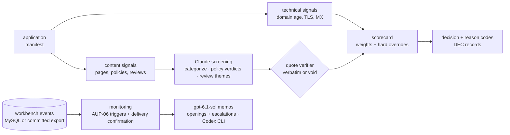

# merchant-risk-screener

A merchant-underwriting pipeline for a BNPL platform: takes a merchant application
(name, URL, category, country), collects technical and content signals from a fixture
website set, screens site content and customer reviews with Claude against a written
acceptable-use policy (verdicts must quote their evidence — enforced mechanically),
scores everything through a transparent config-driven scorecard, and outputs
approve / conditional / manual-review / decline with reason codes. A portfolio-
monitoring module replays ongoing merchant activity day by day, as of what the
platform knew each day, against the AUP-06 triggers: chargeback evidence, with
volume, ticket and new-account-share corroboration, young-merchant concentration
and delivery confirmation. The adopted rule set, s1,
opens review cases and escalates delivery evidence to settlement-pause reviews.

**All 16 fixture merchants are fictional** (generated sites + review corpora with
authored evidence markers); decisions are fully reproducible offline. The companion
repo [`bnpl-fraud-workbench`](https://github.com/nacapule/bnpl-fraud-workbench)
supplies the consumer-side fraud operation this plugs into. Monitoring is evaluated
on three synthetic worlds generated at
[`1db054d`](https://github.com/nacapule/bnpl-fraud-workbench/tree/1db054dacb04da11672d4c4e71267f122ce02e7e)
(seeds 416, 1041 and 2718). World 416 (manifest identity `208122eb…`) supplies
calibration and the dev gate; the two fresh worlds were generated only after s1
was adopted. The earlier results remain in
[`reports/v1-2026-08/`](reports/v1-2026-08), with the workbench's `v1-2026-08` world
and the screener commit
[`8371b9f`](https://github.com/nacapule/merchant-risk-screener/tree/8371b9f) that
produced them.



## Headline results

| item | result |
|---|---|
| fixture set | 16 merchants: 4 approve / 5 conditional / 2 manual-review / 5 decline expected (incl. bilingual, thin-site, borderline-claims, and reputational-collapse cases) |
| decisions | **16/16 exact** vs expected · decline recall 5/5 · screening prompt v2 + scorecard calibration, both iterations measured and logged |
| prohibited recall | **3/3 = 1.0** (missing a prohibited merchant is the unacceptable error; false prohibited flags route to human review instead) |
| quote validity | **117/117 = 100%** — every restricted/prohibited verdict and review quote verified verbatim against source; an unverifiable quote voids its verdict to insufficient-info (AUP-05.1) |
| monitoring (three worlds, as-of replay) | **s1 adopted** · world 416 non-bust-out reviews per 100 eligible merchant-quarters: dev **3.54 vs c0's 17.82**, operating held-out **2.91 vs 20.95** · bust-outs caught before closure: **4 of 4 dev / 4 of 4 held-out** on 416; **7 of 8** on fresh world 1041 and **8 of 8** on fresh world 2718 · delivery confirmation fires at **24 of 24** bust-outs, **15 of 24** before closure, and at no other merchant · [evaluation](reports/monitoring_evaluation.md) |

## Quickstart

```bash
make venv
make demo          # fixtures → screening → scorecard → decisions → monitor replay → memos (all offline)
```

Fully offline: LLM responses for the fixture set are committed
(`screen/eval/cache/`). Live modes use a Claude Code-compatible CLI
(`CLAUDE_CLI_BIN`) or the `anthropic` SDK. Model per task is config-driven
(`config.yaml llm.tasks` — categorize/screen/themes/memo each routable, env
`LLM_MODEL_<TASK>` overrides).

`make monitor-offline` replays the committed event and shipment exports with the
frozen delivery calibration to reproduce s1's case openings, escalations and
dispute-count flags. `make monitor-calibrate` reproduces the early-data calibration;
`make monitor-gate` reproduces the world-416 dev gate. `make monitor` reads MySQL
via `MONITOR_DB_URL`
(default `127.0.0.1:3306/bnpl`); load the companion workbench's current world first.
`make monitor-eval` regenerates the three evaluation JSONs listed in
[`reports/`](reports/README.md).
`make memos-offline` rebuilds [`reports/monitoring_memos.md`](reports/monitoring_memos.md),
49 advisory memos (41 case openings and 8 settlement-pause escalations), from
cached responses of the configured memo model, `gpt-6.1-sol` through the Codex CLI.

## Design notes

- **Policy first.** [`policy/acceptable-use.md`](policy/acceptable-use.md) (AUP-1) is
  the authored document everything cites: prohibited/restricted categories, hygiene
  requirements, reputational evidence standards, monitoring thresholds, reason-code
  taxonomy.
- **Quotes or it didn't happen.** The screening layer's verdicts carry verbatim quotes,
  string-verified against the source (whitespace/case-normalized). A paraphrase voids
  the verdict to insufficient-info — which routes to manual review, the fail-safe
  direction (AUP-05).
- **Deterministic scorecard.** Every weight has a one-line rationale in config; hard
  overrides (any prohibited verdict → decline; any insufficient-info → manual) cannot
  be outvoted by good hygiene — `giftcardhub-mx` exists in the fixture set precisely to
  prove polish doesn't rescue a prohibited category.
- **Decision records.** One page per merchant in [`decisions/`](decisions):
  application summary → signals → verdicts with quotes → scorecard breakdown →
  decision + conditions → what-would-change-it (for declines).
- **Monitoring is point-in-time honest.** An as-of replay evaluates each day using
  events dated by when the platform knew them: orders at order time, disputes at
  opening, refunds at their known time, and shipments and carrier confirmations
  at their known times. A later confirmation never changes an earlier day. A complete
  merchant calendar includes zero-order days, with source, event, shipment and
  calendar totals reconciled. Trailing ratios stay undefined below 20 approved
  orders; baseline comparisons use the prior
  90-day window, excluding the trailing 30 days, with at least 30 baseline days and
  20 baseline orders. Delivery calibration uses only data known by 2024-08-31.
  Prefix checks at all three workbench freeze dates reproduce earlier openings,
  escalations and flags exactly. Screening reads a
  [dated policy snapshot](screen/prompts/acceptable-use_2026-08.md), preserving cached
  screening results while AUP-06 changes. The implementation and frozen protocols
  are specified in [`monitor/ITERATION.md`](monitor/ITERATION.md) §§1 and 4;
  [results](reports/monitoring_evaluation.md).

## Limitations & honesty

- Fixture merchants are fictional and the evidence markers are authored; accuracy on
  this set demonstrates the pipeline's mechanics, not real-world underwriting rates.
- Scorecard weights are stated judgment defaults, not loss-calibrated.
- Monitoring thresholds are modeled on publicly known card-network monitoring-program
  concepts; values and capacity assumptions are illustrative, not calibrated to a
  real portfolio. The three synthetic worlds share one bust-out mechanism, known
  from the workbench's public methods document. World 416's held-out comparison is
  audit-informed; the two fresh worlds were generated after adoption. The gate uses
  only world 416's dev data: follow-up load exceeds 5 in all three worlds and world
  2718's dev load is 5.09. Delivery confirmation is mechanism-informed validation
  for settlement-pause evidence. Remaining exposure is not prevented loss; the
  replay does not simulate intervention or establish general performance.
- Live technical collectors (RDAP/DNS/TLS) are read-only and illustrative; no live
  merchant content is stored.

## License

MIT · Author: Alejandro Guerrero Padrés
