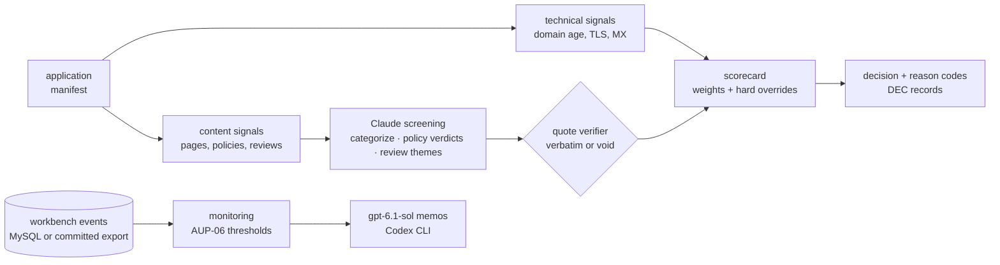

# merchant-risk-screener

A merchant-underwriting pipeline for a BNPL platform: takes a merchant application
(name, URL, category, country), collects technical and content signals from a fixture
website set, screens site content and customer reviews with Claude against a written
acceptable-use policy (verdicts must quote their evidence — enforced mechanically),
scores everything through a transparent config-driven scorecard, and outputs
approve / conditional / manual-review / decline with reason codes. A portfolio-
monitoring module replays ongoing merchant activity day by day, as of what the
platform knew each day, against the AUP-06 triggers for chargebacks and bust-out
trajectories.

**All 16 fixture merchants are fictional** (generated sites + review corpora with
authored evidence markers); decisions are fully reproducible offline. The companion
repo [`bnpl-fraud-workbench`](https://github.com/nacapule/bnpl-fraud-workbench)
supplies the consumer-side fraud operation this plugs into. Monitoring now runs on
its current synthetic event world, regenerated at
[`1db054d`](https://github.com/nacapule/bnpl-fraud-workbench/tree/1db054dacb04da11672d4c4e71267f122ce02e7e)
(seed 416, manifest identity `208122eb…`). The earlier results remain in
[`reports/v1-2026-08/`](reports/v1-2026-08), with the workbench's `v1-2026-08` world
and the screener commit
[`8371b9f`](https://github.com/nacapule/merchant-risk-screener/tree/8371b9f) that
produced them.



## Headline results

| item | result |
|---|---|
| fixture set | 16 merchants: 4 approve / 5 conditional / 2 manual-review / 5 decline expected (incl. bilingual, thin-site, borderline-claims, and reputational-collapse cases) |
| decisions | **16/16 exact** vs expected · decline recall 5/5 · screening prompt v2 + scorecard calibration, both iterations measured and logged |
| prohibited recall | **3/3 = 1.0** (missing a prohibited merchant is the unacceptable error; false prohibited flags route to human review instead) |
| quote validity | **117/117 = 100%** — every restricted/prohibited verdict and review quote verified verbatim against source; an unverifiable quote voids its verdict to insufficient-info (AUP-05.1) |
| monitoring (current workbench world, as-of replay) | AUP-06 control c0 (shipped): **1 of 4 dev / 1 of 4 held-out** bust-outs caught before closure, 10 / 6 days ahead, with 21 non-bust-out alert episodes per 100 merchant-quarters in the held-out period · dev-ranked young-merchant rule c1b: **4 of 4 / 4 of 4**, held-out leads of 18–49 days, no added workload; not shipped, because the pre-registered workload ceiling rejected the control itself · [evaluation](reports/monitoring_evaluation.md) |

## Quickstart

```bash
make venv
make demo          # fixtures → screening → scorecard → decisions → monitor replay → memos (all offline)
```

Fully offline: LLM responses for the fixture set are committed
(`screen/eval/cache/`). Live modes use a Claude Code-compatible CLI
(`CLAUDE_CLI_BIN`) or the `anthropic` SDK. Model per task is config-driven
(`config.yaml llm.tasks` — categorize/screen/themes/memo each routable, env
`LLM_MODEL_<TASK>` overrides).

`make monitor-offline` replays the committed event export to reproduce c0's alert
episodes and dispute-count flags. `make monitor` reads MySQL via `MONITOR_DB_URL`
(default `127.0.0.1:3306/bnpl`); load the companion workbench's current world first.
`make monitor-eval` regenerates the frozen comparison in
[`reports/monitoring_evaluation.json`](reports/monitoring_evaluation.json).
`make memos-offline` rebuilds [`reports/monitoring_memos.md`](reports/monitoring_memos.md),
one advisory memo per c0 alert episode (140), from the cached responses of the
configured memo model, `gpt-6.1-sol` through the Codex CLI.

## Design notes

- **Policy first.** [`policy/acceptable-use.md`](policy/acceptable-use.md) (AUP-1) is
  the authored document everything cites: prohibited/restricted categories, hygiene
  requirements, reputational evidence standards, monitoring thresholds, reason-code
  taxonomy.
- **Quotes or it didn't happen.** The screening layer's verdicts carry verbatim quotes,
  string-verified against the source (whitespace/case-normalized). A paraphrase voids
  the verdict to insufficient-info — which routes to manual review, the fail-safe
  direction (AUP-05).
- **Deterministic scorecard.** Every weight has a one-line rationale in config; hard
  overrides (any prohibited verdict → decline; any insufficient-info → manual) cannot
  be outvoted by good hygiene — `giftcardhub-mx` exists in the fixture set precisely to
  prove polish doesn't rescue a prohibited category.
- **Decision records.** One page per merchant in [`decisions/`](decisions):
  application summary → signals → verdicts with quotes → scorecard breakdown →
  decision + conditions → what-would-change-it (for declines).
- **Monitoring is point-in-time honest.** An as-of replay evaluates each day using
  events dated by when the platform knew them: orders at order time, disputes at
  opening, refunds at their known time. A complete merchant calendar includes
  zero-order days, with source, event and calendar totals reconciled. Trailing ratios
  stay undefined below 20 approved orders; baseline comparisons use the prior
  90-day window, excluding the trailing 30 days, with at least 30 baseline days and
  20 baseline orders. Prefix checks at all three workbench freeze dates reproduce
  earlier alerts and flags exactly. The AUP-06 implementation details (data-sufficiency
  floors, 90-day episodes, the dispute-count flag) are specified in
  [`monitor/ITERATION.md`](monitor/ITERATION.md) §1;
  [results](reports/monitoring_evaluation.md).

## Limitations & honesty

- Fixture merchants are fictional and the evidence markers are authored; accuracy on
  this set demonstrates the pipeline's mechanics, not real-world underwriting rates.
- Scorecard weights are stated judgment defaults, not loss-calibrated.
- Monitoring thresholds are modeled on publicly known card-network monitoring-program
  concepts; values are illustrative, not calibrated. The frozen held-out comparison
  covers four bust-outs on one synthetic seed and is audit-informed: the prior audit
  had already summarised all eight bust-outs. It is not a blind test or a general
  performance estimate.
- Live technical collectors (RDAP/DNS/TLS) are read-only and illustrative; no live
  merchant content is stored.

## License

MIT · Author: Alejandro Guerrero Padrés
