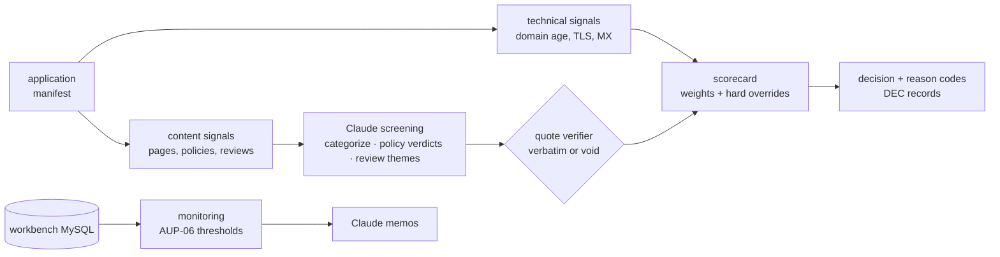

# merchant-risk-screener

A merchant-underwriting pipeline for a BNPL platform: takes a merchant application
(name, URL, category, country), collects technical and content signals from a fixture
website set, screens site content and customer reviews with Claude against a written
acceptable-use policy (verdicts must quote their evidence — enforced mechanically),
scores everything through a transparent config-driven scorecard, and outputs
approve / conditional / manual-review / decline with reason codes. A portfolio-
monitoring module catches chargeback breaches and bust-out trajectories in ongoing
merchant activity.

**All 16 fixture merchants are fictional** (generated sites + review corpora with
authored evidence markers); decisions are fully reproducible offline. The companion
repo [`bnpl-fraud-workbench`](../bnpl-fraud-workbench) supplies the consumer-side
fraud operation this plugs into.



## Headline results

| item | result |
|---|---|
| fixture set | 16 merchants: 4 approve / 5 conditional / 2 manual-review / 5 decline expected (incl. bilingual, thin-site, borderline-claims, and reputational-collapse cases) |
| decisions | **16/16 exact** vs expected · decline recall 5/5 · screening prompt v2 + scorecard calibration, both iterations measured and logged |
| prohibited recall | **3/3 = 1.0** (missing a prohibited merchant is the unacceptable error; false prohibited flags route to human review instead) |
| quote validity | **117/117 = 100%** — every restricted/prohibited verdict and review quote verified verbatim against source; an unverifiable quote voids its verdict to insufficient-info (AUP-05.1) |
| monitoring | both injected merchant bust-outs caught by **leading** indicators (avg-ticket drift ~2× + 100% new-account GMV) weeks before their chargeback waves land; chargebacks attributed by *opened* date — the monitor cannot see future disputes |

## Quickstart

```bash
make venv
make demo          # fixtures → screening (offline cache) → scorecard → decisions
```

Fully offline: LLM responses for the fixture set are committed
(`screen/eval/cache/`). Live modes use a Claude Code-compatible CLI
(`CLAUDE_CLI_BIN`) or the `anthropic` SDK. Model per task is config-driven
(`config.yaml llm.tasks` — categorize/screen/themes/memo each routable, env
`LLM_MODEL_<TASK>` overrides). The monitoring module needs the companion repo's
MySQL up (`make monitor`).

## Design notes

- **Policy first.** [`policy/acceptable-use.md`](policy/acceptable-use.md) (AUP-1) is
  the authored document everything cites: prohibited/restricted categories, hygiene
  requirements, reputational evidence standards, monitoring thresholds, reason-code
  taxonomy.
- **Quotes or it didn't happen.** The screening layer's verdicts carry verbatim quotes,
  string-verified against the source (whitespace/case-normalized). A paraphrase voids
  the verdict to insufficient-info — which routes to manual review, the fail-safe
  direction (AUP-05).
- **Deterministic scorecard.** Every weight has a one-line rationale in config; hard
  overrides (any prohibited verdict → decline; any insufficient-info → manual) cannot
  be outvoted by good hygiene — `giftcardhub-mx` exists in the fixture set precisely to
  prove polish doesn't rescue a prohibited category.
- **Decision records.** One page per merchant in [`decisions/`](decisions):
  application summary → signals → verdicts with quotes → scorecard breakdown →
  decision + conditions → what-would-change-it (for declines).
- **Monitoring is point-in-time honest.** Chargebacks lag 60–95 days in the simulated
  data, so the leading indicators (volume z-score, ticket drift, new-account GMV
  share) do the early catching — exactly the dynamic real monitoring programs face.

## Limitations & honesty

- Fixture merchants are fictional and the evidence markers are authored; accuracy on
  this set demonstrates the pipeline's mechanics, not real-world underwriting rates.
- Scorecard weights are stated judgment defaults, not loss-calibrated.
- Monitoring thresholds are modeled on publicly known card-network monitoring-program
  concepts; values are illustrative.
- Live technical collectors (RDAP/DNS/TLS) are read-only and illustrative; no live
  merchant content is stored.

## License

MIT · Author: Alejandro Guerrero Padrés
